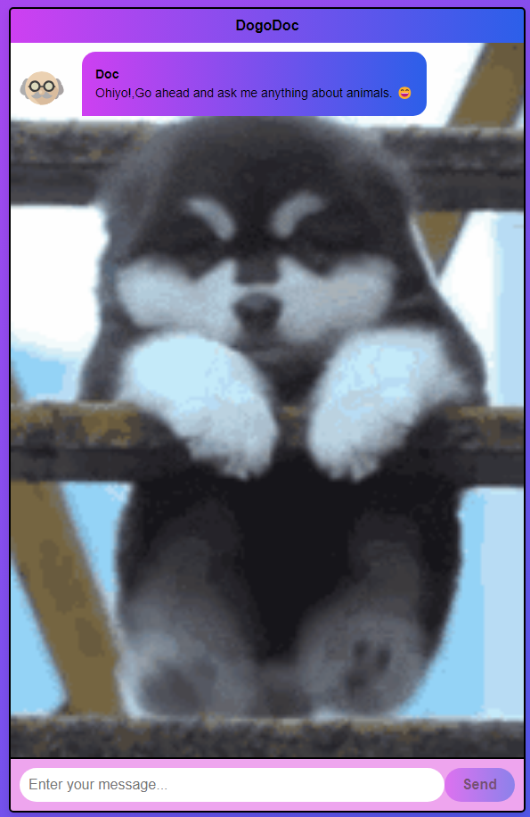

# DogoDoc - Animal Care Chatbot

DogoDoc is a web-based chatbot that offers information and advice about animals and pet care. Powered by OpenAI's GPT-3.5 language model and built using the Flask web framework, this chatbot provides a user-friendly interface for users to interact and receive informative responses.



## Features

- **Interactive Chat Interface:** Engage with the chatbot through a sleek and intuitive user interface.
- **GPT-3.5 Integration:** Utilize OpenAI's GPT-3.5-Turbo model for generating contextual and helpful responses.
- **Contextual Conversations:** Maintain ongoing conversations with the chatbot, making interactions feel natural and coherent.
- **Animal Care Expertise:** Ask questions and seek advice about animals, pet care, and related topics.

## Live Demo

🚀 **[Check out the Live Demo](https://dogodoc.pythonanywhere.com/)** - DogoDoc is presently online, generously sponsored by PythonAnywhere. Please note that this version is in beta testing and may have some bugs as we continue to refine its performance.

## Installation

1. Clone the repository:
   ```sh
   git clone https://github.com/droidyprojectum/dogodoc.git
   ```

2. Navigate to the project directory:
   ```sh
   cd dogodoc
   ```

3. Install the required Python packages:
   ```sh
   pip install Flask openai
   ```

4. Set up your OpenAI API key:
   - Sign up for an OpenAI account and obtain an API key.
   - Replace `'YOUR_OPENAI_API_KEY'` in `app.py` with your actual API key.

## Usage

1. Run the Flask app:
   ```sh
   python app.py
   ```

2. Open a web browser and go to `http://localhost:5000` to access the chatbot interface.

3. Chat with the bot by entering messages in the input field and clicking the "Send" button.

## Customization

- **UI Customization:** Modify the chat interface by editing the HTML and CSS files in the `templates` and `static/styles` directories.

- **Bot Appearance:** Adjust the bot's name, image, and other details in the JavaScript code within the HTML file.

## Contributing

Contributions are welcome! If you have ideas for improvements or find any issues, feel free to open a pull request or submit an issue.

1. Fork the repository.
2. Create a new branch: `git checkout -b feature/my-feature`.
3. Make your changes and commit them: `git commit -m 'Add some feature'`.
4. Push to the branch: `git push origin feature/my-feature`.
5. Open a pull request.

## License

This project is licensed under the MIT License. See the [LICENSE](./LICENSE) file for details.
